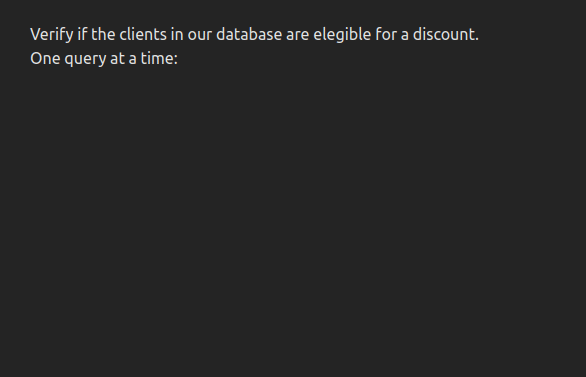

# Limited Concurrency Demo

This project showcases a technique to queue and limit the number of concurrent calls to an API, by leveraging [tanstack-query](https://tanstack.com/query/latest) features.

This allows you to balance the need for speed in displaying results to the user, versus flooding the server with multiple expensive requests, or having your requests denied due to rate limiting policies.

Please read the [Limited Concurrency for Multiple API calls in React](http://dezoito.github.io/2024/03/21/react-limited-concurrency.html) article for a detailed explanation of the concepts and code used in this demo.

---

In the animation below, we simulate the process of using a complex API to define if clients are eligible for a discount.

Processing is done sequentially first, then with 2 and 3 concurrent calls at a time:



When we increase the number of concurrent requests, overlaps happen as the API is handling simultaneous requests that have different processing times.

Limiting concurrency is useful when you don't want to make numerous simultaneous calls to an API server, such as:

- The calls you are making are resource expensive, putting heavy demand on the server.
- You have rate limits on the API.
- Your users expect the calls to be queued and processed sequentially.

## How to run

Clone this repository and cd to the project folder:

```sh
git clone https://github.com/dezoito/queries-app.git
cd ./queries-app
```

Install the dependecies:

```sh
yarn install
```

Run the project

```sh
yarn dev
```

Check the output of the last command to see the host and port where it is running:

```sh
  VITE v5.2.2  ready in 283 ms

  ➜  Local:   http://localhost:5173/
  ➜  Network: use --host to expose
  ➜  press h + enter to show help
```
