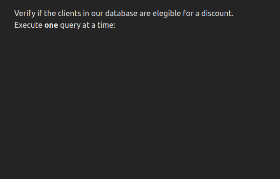

# Limited Concurrency Demo

This project showcases a technique to queue and limit the number of concurrent calls to an API, by leveraging [tanstack-query](https://tanstack.com/query/latest) features.

LINK TO ARTICLE

This technique is useful when you don't want to make numerous simultaneous calls to an API server, such as:

- The calls you are making are resource expensive, putting heavy demand on the server.
- You have rate limits on the API.
- Your users expect the calls to be queued and processed sequentially.

In the animation below, we process the same list, first sequentially, then with 2 concurrent calls at a time:



## The use-case

In this example, we will use a very complex on-premisses AI API to determine if each cclient in a list is eligible for a discount.

As each of these queries can require a ton of memory and processing power, we want to queue each name, instead of sending multiple concurrent calls and risk crashing the API server.

## How to run

Clone this repository and cd to the project folder:

```sh
git clone https://github.com/dezoito/queries-app.git
cd ./queries-app
```

Install the dependecies:

```sh
yarn install
```

Run the project

```sh
yarn dev
```

Check the output of the last command to see the host and port where it is running:

```sh
  VITE v5.2.2  ready in 283 ms

  ➜  Local:   http://localhost:5173/
  ➜  Network: use --host to expose
  ➜  press h + enter to show help
```
